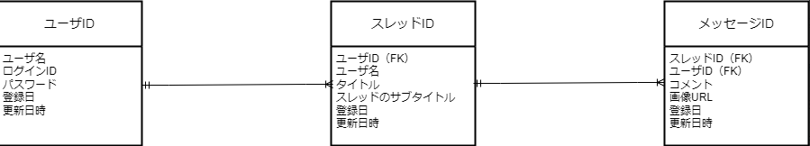

# Threads-API

## 概要

WEB アプリケーションの仕組みの理解とメンテナンス性や拡張性を意識したコードを書く勉強のアウトプットを目的として、掲示板アプリのデータを提供する API サーバを構築しました。  
認証はログイン処理後、JWT が発行され API サーバ接続時に認証が行われる仕組みです。

## 今後

- OAuth を利用した認証
- フロント側の構築が完了後デプロイ
- Clean Architecture の理解を深め、よりメンテナンス性や拡張性を意識したコードへ改良

## Front 側

開発中...

## URI

### 認証と User 情報

| URI     | method | 処理内容          |
| ------- | ------ | ----------------- |
| /signup | POST   | 新規登録          |
| /login  | POST   | ログイン機能      |
| /logout | POST   | ログアウト        |
| /csrf   | GET    | CSRF トークン発行 |
| /       | DELETE | ユーザ情報削除    |
| /       | PUT    | ユーザ情報の更新  |
| /       | GET    | ユーザ情報の取得  |

### Thread 情報

| URI      | method | 処理内容       |
| -------- | ------ | -------------- |
| /threads | GET    | スレッド表示   |
| /threads | POST   | スレッドの作成 |
| /threads | DELETE | スレッドの削除 |
| /threads | PUT    | スレッドの編集 |

### Message 情報

| URI                | method | 処理内容         |
| ------------------ | ------ | ---------------- |
| /threads/:threadid | GET    | メッセージの取得 |
| /threads/:threadid | POST   | メッセージの作成 |
| /threads/:threadid | DELETE | メッセージの削除 |
| /threads/:threadid | PUT    | メッセージの更新 |

## DataBase 設計

### 画像の管理

Cloud Storage for Firebase を使用。  
Database には Cloud Storage のファイルへのディレクトリを示す文字列を格納。

## 技術スタック

### 言語

- golang

### フレームワーク

- Echo

### アーキテクチャ

- Clean Architecture

### Database

- PostgreSQL
- Cloud Storage for Firebase

### ORM

- gorm

### その他(ツールなど)

- Docker
- pgAdmin4
- GitHub
- Postman
